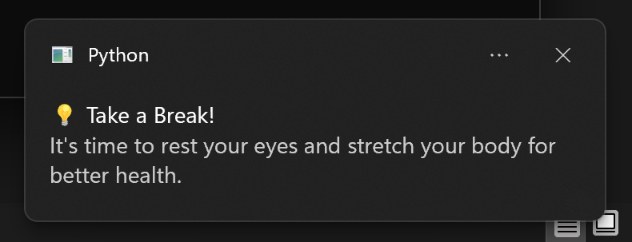

# 🖥️ Desktop Break Reminder

A simple Python script that sends **timely desktop notifications** reminding you to take regular breaks — ideal for maintaining eye health and physical wellness while working long hours on a computer.

---

## 📌 Features

* 🔔 Sends custom **desktop notifications**
* ⏱️ User-defined reminder interval (in minutes)
* 🧘 Helps prevent fatigue by encouraging regular breaks
* 🪄 Can run silently in the background (Windows support included)

---

## 🛠️ Requirements

Install the required package:

```bash
pip install plyer
```

---

## ▶️ How to Use

1. Save the file as `desktop_notifier.py`
2. Run the script:

```bash
python desktop_notifier.py
```

3. When prompted, enter the number of minutes between break reminders.

---

## ⚙️ Run in Background (Windows)

You can run the script **silently in the background** using `pythonw.exe` (no terminal window will appear):

### Steps:

1. Save the script as `Desktop Notifier.py`
2. Open **PowerShell** or **Command Prompt**
3. Use one of the following commands:

```bash
pythonw "Desktop Notifier.py"
```

Or, using the full path to `pythonw.exe`:

```bash
"C:\Path\To\pythonw.exe" "C:\Path\To\Desktop Notifier.py"
```

> 📝 *Make sure `pythonw.exe` exists in your Python installation directory (e.g., `C:\Users\<YourName>\AppData\Local\Programs\Python\Python311\`).*

---

## 📋 Example Notification

**💡 Take a Break!**
*It's time to rest your eyes and stretch your body for better health.*

---

## 🧑‍💻 Author

Developed by **Akarsh Kumar** — enhancing productivity and wellness with Python automation 💡

